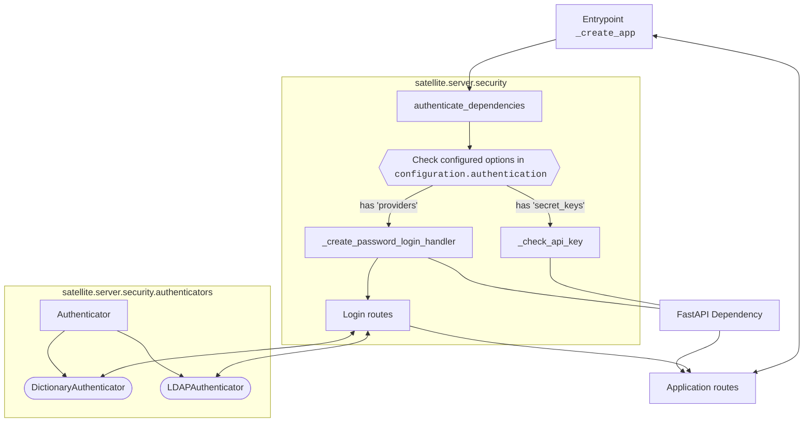

# Security architecture

## Authentication

For the authentication of users, the following is a rough schematic of how the code is laid out:

For the `API Key` method, a simple [`Dependency`](https://fastapi.tiangolo.com/tutorial/dependencies/) function is created, which checks the request headers for
a valid API Key, and if none is found, either an exception is raised, or `False` is returned (when anonymous access is allowed).

For the `Providers`, currently the only method implemented is `password`, meaning the user sends in a **user name** and a **password** for authentication.
This is implemented with the [`OAuth2PasswordBearer`](https://fastapi.tiangolo.com/reference/security/#fastapi.security.OAuth2PasswordBearer) dependency, and
the [OAuth2PasswordRequestForm](https://fastapi.tiangolo.com/reference/security/#fastapi.security.OAuth2PasswordRequestForm) dependency for retrieving the
necessary information in the `login` endpoint.

On the `Providers` implementation, the configuration associated with a provider includes instructions to load a class that will actually authenticate the user.
This class must be a subclass of [`Authenticator`](../src/satellite/server/security/authenticators.py), and can communicate with other services to ensure the
provided credentials are valid.

For all the token-based authentication methods, a successful authentication returns to the user a `access_token` and a `refresh_token`, both of which are
[JWT](https://www.jwt.io/introduction#what-is-json-web-token) tokens. These allow the user to access resources on the server until they expire, by adding them
into the request header. The verification of the token's validity is done in the `_get_decoded_token` and `get_current_user` functions on the security module,
which are then added to the normal API Routes as Dependencies.

In order to revoke tokens before they expire, a dictionary `JWT_BLACKLIST` is kept in the global scope of the security module. It is keyed by the provider name,
and its value is a set of blacklisted tokens. This set is verified on every operation to ensure a revoked token doesn't succeed in authenticating.

#### Client implementation

On the client side, the authentication feature of [`httpx`](https://www.python-httpx.org/advanced/authentication/) is used. In `client.py`, a `httpx.Auth` subclass
is created to handle adding the proper HTTP headers for authentication. If an access token has expired, an attempt is made to refresh it using the refresh token,
making the token handling transparent to the user.
